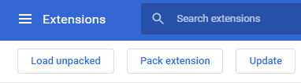

# Death To AdBlock Haters
I think everybody has the right to choose between sharing browsing habits and other personal data to 3rd party Ad providers. Also, for the sake of Human progress and well-being, knowledge, discoveries and new ideas shouldn't cost money, particularly on the web.

This Chrome and Firefox extension removes AdBlock warnings and paywalls popups from common blogs and asshole newspaper websites, allowing to viewer to read the full text. 

### How to install
##### Chrome #####
- Clone this repository somewhere on your computer, where it will stay permanently
- Go to Chrome Extensions Manager, through the menu or with the URL: `chrome://extensions`

- Activate the **Developer Mode** in the upper right corner

- Click on **Load Unpacked** and specify the folder where you've cloned this repository

- Ensure the extension is properly activated

### Currently supported websites
##### Chrome #####
- New York Times (www.nytimes.com)
- MTL Blog (www.mtlblog.com)
- Journal de Montréal (www.journaldemontreal.com)
- Journal de Québec (www.journaldequebec.com)
- Le Devoir (www.ledevoir.com)
- La Presse (www.lapresse.ca)
- Washington Post (www.washingtonpost.com)
- L'Actualité (www.lactualite.com)
- National Geographic (www.nationalgeographic.com)
- Science & Vie (www.science-et-vie.com)
- The Globe And Mail (www.theglobeandmail.com)
- Météo Média (www.meteomedia.com)
- Business Insider (www.businessinsider.com)

##### Firefox #####
- MTL Blog (www.mtlblog.com)
- Journal de Montréal (www.journaldemontreal.com)
- Journal de Québec (www.journaldequebec.com)
- La Presse (www.lapresse.ca)
- L'Actualité (www.lactualite.com)
- National Geographic (www.nationalgeographic.com)
- Science & Vie (www.science-et-vie.com)
- The Globe And Mail (www.theglobeandmail.com)
- Météo Média (www.meteomedia.com)
- Business Insider (www.businessinsider.com)

### See also
##### AdBlock / AdBlock Plus (Chrome extensions)
Blocks common ads
- https://chrome.google.com/webstore/detail/adblock-%E2%80%94-best-ad-blocker/gighmmpiobklfepjocnamgkkbiglidom
- https://chrome.google.com/webstore/detail/adblock-plus-free-ad-bloc/cfhdojbkjhnklbpkdaibdccddilifddb

##### Ghostery  (Chrome extensions)
Prevent _some_ tracking by advertisers
- https://chrome.google.com/webstore/detail/ghostery-%E2%80%93-privacy-ad-blo/mlomiejdfkolichcflejclcbmpeaniij?hl=en

### Contributors
sinetix
